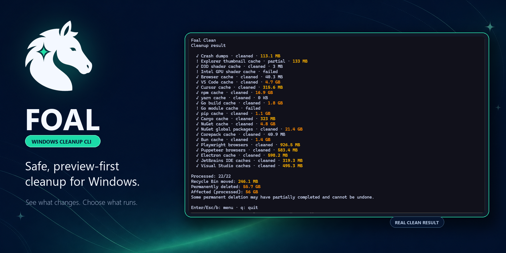

# Foal

[](https://github.com/CoreyLyn/Foal/actions/workflows/ci.yml)
[](LICENSE)



Foal is a safe, preview-first cleanup CLI for Windows developers and power users.

It finds reclaimable space, explains the planned action, and makes destructive work explicit. Foal also provides project-artifact cleanup, disk analysis, system snapshots, operation history, and confirmed application uninstall.

> [!IMPORTANT]
> Foal is pre-release software. Preview the result before execution and review permanent-deletion selections carefully.

## Why Foal?

- **Preview first** — inspect candidates and their planned actions before changing files.
- **Conservative by default** — broader categories require an explicit CLI opt-in or a disclosed TUI confirmation.
- **Windows-aware safety** — protected paths, reparse points, permissions, running applications, and Recycle Bin capacity are first-class checks.
- **No silent elevation** — ordinary cleanup stays non-elevated. Only explicitly selected Windows servicing and eligible Uninstall work may request a disclosed UAC prompt.
- **Automation-friendly** — JSON is the stable contract shared by the CLI and TUI.

Foal is inspired by tools such as Mole, but follows its own Windows-specific safety model rather than pursuing feature parity.

## Install

### One-liner (Windows PowerShell)

```powershell
irm https://raw.githubusercontent.com/CoreyLyn/Foal/main/scripts/install.ps1 | iex
```

This downloads the latest GitHub Release ZIP for your CPU (amd64 or arm64), verifies SHA-256 against `checksums.txt`, installs `foal.exe` to `%LOCALAPPDATA%\Programs\foal`, and prepends that directory to your user `PATH`.

### Manual download

Download the Windows amd64 or arm64 ZIP from [GitHub Releases](https://github.com/CoreyLyn/Foal/releases), extract `foal.exe`, and place it on your `PATH`.

Release archives include SHA-256 checksums and GitHub provenance attestations. Current binaries are not Authenticode-signed; Windows may show an unrecognized-app warning (including for the install script path). ARM64 builds remain preview builds until native ARM64 smoke testing is available. Scoop and WinGet are planned later; see [`docs/plan/release-process.md`](docs/plan/release-process.md).

### Build from source

Install Go 1.25 or later on Windows:

```powershell
git clone https://github.com/CoreyLyn/Foal.git
cd Foal
go build -o foal.exe ./cmd/foal
.\foal.exe --version
```

## Agent skill

Install the bundled [`foal-full-clean`](skills/foal-full-clean/SKILL.md) skill:

```powershell
npx skills add coreylyn/foal
```

The skill checks whether Foal is installed, tries the official installer when needed, previews the broadest supported Clean selection, and runs permanent cleanup and Windows component-store servicing only with explicit authorization.

## Quick start

Preview conservative cleanup candidates without deleting anything:

```powershell
foal clean --dry-run
```

Open the interactive TUI:

```powershell
foal
```

Run the default cleanup after reviewing the preview:

```powershell
foal clean --execute
```

Permanent-action categories need explicit per-run authorization:

```powershell
foal clean --execute --opt-in browser_cache --allow-permanent
```

For scripts, request structured output:

```powershell
foal clean --dry-run --json
foal status --json
foal history --json
```

## Commands

| Command | Behavior |
| --- | --- |
| `foal` | Opens the interactive TUI in a terminal. |
| `foal clean` | Previews or executes catalog-based cleanup. Requires `--dry-run` or `--execute`. |
| `foal purge <root...>` | Previews or permanently removes allowlisted rebuildable project artifacts under explicit roots. |
| `foal analyze <path>` | Read-only directory insight (totals, top children, optional artifact clues). Explicit local volume roots allowed for Analyze only; no deletion. |
| `foal status` | Reports a read-only Windows and Foal state snapshot. |
| `foal history` | Reads prior Clean, Purge, and Uninstall operation records. |
| `foal uninstall` | Previews installed applications; confirmed execution uses an official uninstaller or an eligible portable-removal plan. |
| `foal version` | Reports version, commit, Go runtime, and target platform. |

Run `foal --help` for the complete shipped flag surface.

## Cleanup model

Every executable Clean category declares exactly one action:

- `move_to_recycle_bin` for recoverable cleanup.
- `delete_permanently` for narrowly proven regenerable or re-downloadable content.
- `invoke_windows_servicing` for the Windows component store, which Foal never treats as deletion candidates (see below).

Permanent deletion is never a fallback when a Recycle Bin operation fails. The CLI requires both `--execute` and `--allow-permanent` for permanent work; without authorization, those candidates are skipped while eligible Recycle Bin work can continue. The TUI presents the same actions in one strengthened confirmation.

Foal resolves candidates again, reloads protection rules, runs applicable safety gates, and validates every path immediately before mutation. Recycle Bin work runs first, permanent work next, and Windows servicing last. Local failures do not silently broaden the cleanup scope.

Available opt-in groups:

| Group | Includes |
| --- | --- |
| `dev-caches` | Supported package-manager, build-tool, browser-runtime, IDE, and editor caches. |
| `app-caches` | Supported non-editor application caches (currently Obsidian and VRChat), plus the `electron-updater-residue` opt-in. |
| `cli-agents` | Independently approved product-scoped CLI-agent residue, currently Grok Build updater backups. |
| `all` | Every standard-selection executable opt-in category; exact-selection-only categories stay excluded. Safety gates and action-specific authorization still apply. |

The six exact-selection-only categories are `nvidia_installer_cache`, `lghub-cache`, `thunder-update-download`, `windows-temp`, `windows-update-download-cache`, and `winsxs_component_store`. They are deliberately excluded from `all`, every group token, and TUI Select All. Name one exactly to include it.

Use an exact category name when you want the narrowest scope:

```powershell
foal clean --dry-run --opt-in vscode_cache
foal clean --execute --opt-in vscode_cache --allow-permanent
```

### Windows component store (WinSxS) analysis and cleanup

`winsxs_component_store` is an exact-selection-only category with the planned action `invoke_windows_servicing`. Foal never treats `WinSxS` as a directory of deletion candidates and never estimates reclaimable bytes. Instead, an exact dry-run opt-in delegates a read-only component-store analysis to the Windows servicing stack through an isolated, capability-limited elevated helper:

```powershell
foal clean --dry-run --opt-in winsxs_component_store
```

This runs `DISM /Online /Cleanup-Image /AnalyzeComponentStore /English /NoRestart` under a disclosed UAC prompt and reports a path-free servicing operation (`ready`, `no_work`, `skipped`, `failed`, or `canceled`) with the reclaimable package count and cleanup recommendation — it deletes nothing. Because the category is exact-selection-only, default Dry-run and group tokens never analyze `WinSxS` or trigger UAC. Entering Clean in the TUI also does not analyze it automatically; the user must invoke that row's separate analysis action.

Component-store cleanup (mutation) requires `--execute`, an exact selection of the category, and the dedicated per-run `--allow-servicing` authorization, which is independent of and never implied by `--allow-permanent`:

```powershell
foal clean --execute --opt-in winsxs_component_store --allow-servicing
```

Missing `--allow-servicing` skips the category with `windows_servicing_not_authorized` and never opens UAC. When authorized, the elevated helper runs a fresh analysis and starts `DISM /Online /Cleanup-Image /StartComponentCleanup /English /NoRestart` in the same session, only when the reclaimable package count is positive and cleanup is recommended. Servicing is always the final action group, after Recycle Bin and permanent-delete work. Foal never runs `/ResetBase`, `/SPSuperseded`, `/Remove-Package`, or custom DISM arguments, never deletes `WinSxS` files itself, and never forces a reboot: exit `0` is completed, `3010` is completed with a restart required, `3017` is failed with a restart required, and any other non-zero exit is failed. Once cleanup starts, cancellation is recorded but DISM, the helper, and TrustedInstaller are never killed — Foal waits for the actual outcome.

Off Windows there is no component store, so the category fails closed with `unsupported_platform` and never opens a prompt or touches the filesystem.

### NVIDIA installer cache

`nvidia_installer_cache` is an exact-selection-only category with the planned action `move_to_recycle_bin`. Foal discovers only strictly validated, completed legacy NVIDIA display-driver download-task directories under the fixed `C:\ProgramData\NVIDIA Corporation\Downloader` root. A candidate must have a bounded, unique `status.json` record (`status == 2`, `downloadType == 1`), a non-empty version/checksum/`fileLocation`, an HTTPS `download.nvidia.com` origin, a single ordinary payload file matching its checksum with a valid NVIDIA Authenticode signature, no reparse points/alternate streams/extra hard links/extra entries/recent writes/active references, and idle NVIDIA process/service state both before and after inspection. If any relevant NVIDIA application, container, helper, overlay, installer, or service is active — or its state is unknown — Foal skips the whole category. Frequent conservative skips are expected, and Clean never stops NVIDIA processes or services.

```powershell
foal clean --dry-run --opt-in nvidia_installer_cache
foal clean --execute --opt-in nvidia_installer_cache
```

Execution moves the verified package to the Recycle Bin, so it stays locally recoverable. The category **does not require and never uses `--allow-permanent`**: NVIDIA's layout evidence is Not proven, so permanent deletion is deliberately ineligible and `--allow-permanent` can never promote it. A Recycle Bin capacity failure remains a skip and never falls back to permanent deletion. Removing the package means an offline install or rollback may require downloading the driver again; Foal does not promise rollback is unaffected. Off Windows, signature and forensic validation fail closed so no candidate is produced.

Preview both new categories together with repeated `--opt-in` flags (each `--opt-in` still takes a single value):

```powershell
foal clean --dry-run --opt-in winsxs_component_store --opt-in nvidia_installer_cache
```

A mixed execution that also selects proven permanent-delete categories must include `--allow-permanent` independently of `--allow-servicing`.

The authoritative category list, action matrix, impact notes, and exclusions live in the [Clean deletion policy](docs/plan/clean-deletion-policy.md).

## Analyze

`analyze` measures one path and never changes files:

```text
foal analyze
foal analyze .\my-project
foal analyze --json C:\
```

- Omit the path to measure the current directory.
- Explicit local fixed/removable volume roots are accepted for Analyze only; Clean and Purge still reject dangerous roots.
- Matching direct-child names may be labeled `project_artifact_clue` (TUI shows a compact `artifact` label). Nested matches are not classified during size walks.
- When the measured root is a valid Purge root and a direct artifact clue is present, the human report may show copy-only `foal purge <root>` guidance. Analyze never launches Purge.
- The interactive TUI is a read-only on-demand disk browser (local drives → ranked children → drill-down). It does not delete, open files, elevate, or write History.

## Project artifact purge

`purge` is separate from Clean. It only scans roots you provide and previews by default:

```powershell
foal purge .\my-project
foal purge --json .\project-a .\project-b
```

The v1 allowlist matches exact directory names: `node_modules`, `target`, `dist`, `build`, `.build`, `.next`, and `__pycache__`. Volume roots and Windows system paths are rejected.

Execution re-discovers matches and permanently removes them only with per-run authorization:

```powershell
foal purge --execute --allow-permanent .\my-project
```

Deleted dependencies or build output may need to be downloaded or rebuilt. Purge never performs secure erasure, elevation, process stopping, installer cleanup, or implicit root discovery.

## Uninstall

`uninstall` previews installed traditional desktop applications by default. Execution requires an explicit selection:

```powershell
foal uninstall --json
foal uninstall --execute --select "Example App"
```

Foal prefers the application's official quiet uninstaller, then falls back to its interactive uninstaller. Running applications are skipped unless `--allow-stop-processes` is supplied. After a successful official uninstall, Foal moves only the revalidated subset of the already confirmed high-confidence leftover paths to the Recycle Bin; a failed or canceled uninstaller deletes nothing.

An app with no uninstall command may be eligible for portable directory removal when it has a trusted install location. That path requires `--execute --allow-permanent`, permanently deletes only the freshly revalidated install tree, and is never a fallback for a failed official uninstaller. The CLI and TUI call the same execution path and write Uninstall outcomes to History.

## Protection rules

Create `%APPDATA%\Foal\protection.txt` to exclude paths from Clean, Purge, and Uninstall deletion. Use one absolute local path per line; `#` begins a comment. A rule protects that exact path and its full subtree.

```text
# Keep local development data
D:\Work\ImportantProject
C:\Users\me\AppData\Local\Example\Cache
```

Set `FOAL_PROTECTION_FILE` to use a different file. Rules are deny-only: they can remove candidates, but never add or authorize cleanup. Invalid lines are skipped and reported; an unreadable selected file or invalid UTF-8 fails closed. UNC paths, relative paths, and 8.3 short-name paths are rejected.

## Safety boundaries

Foal deliberately does not:

- empty the Recycle Bin;
- silently elevate or stop applications (component-store servicing and eligible Uninstall work may request disclosed UAC; process stopping requires `--allow-stop-processes` and is off by default);
- treat browser history, cookies, credentials, sessions, or user-authored data as cache;
- claim secure erasure or guaranteed physical-space recovery;
- delete unconfirmed, shared-state, or orphaned application residue; a failed or canceled uninstaller never deletes confirmed leftovers;
- perform system optimization actions.

Generic administrator-only cleanup remains a read-only permission-boundary notice. The exact `winsxs_component_store` servicing workflow is the narrow, separately authorized exception. `optimize` is reserved for future read-only health checks and recommendations.

## Platform and releases

- Compatibility baseline: Windows 10 or Windows Server 2016 and later.
- Primary target: Windows 11 x64.
- Release artifacts: portable amd64 and arm64 ZIP archives containing `foal.exe`.
- Release flow: tag-driven draft releases, manually smoke-tested before publishing.

See the [release process](docs/plan/release-process.md) and [Windows support research](docs/research/windows-support.md) for verification details.

## Development

```powershell
go test ./...
go build -o foal.exe ./cmd/foal
```

Safety invariants and JSON contracts take priority over human-output snapshots. Product and architecture decisions are documented under [`docs/`](docs/).

## License

Foal is licensed under the [GNU General Public License v3.0 only](LICENSE) (`GPL-3.0-only`).
